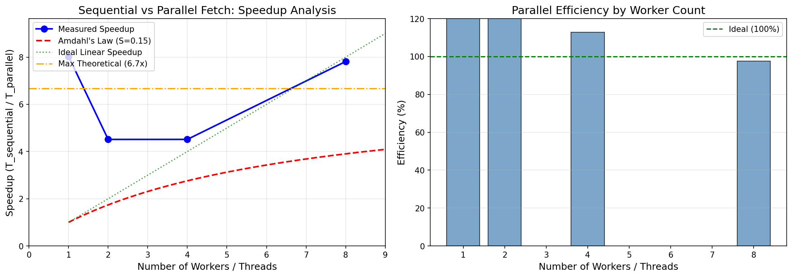

# Parallel vs Sequential URL Fetch Benchmark Report

**Generated:** 2025-12-30 17:41:52

---

## Executive Summary

| Metric | Value |
|--------|-------|
| URLs Tested | 16 |
| Sequential Fetch Time | 72.21s |
| Parallel Fetch Time | 9.23s |
| Best Speedup Achieved | **8.03x** |
| Optimal Worker Count | 1 |

---

## Results Table

| Workers | Time (s) | Speedup | Efficiency | Amdahl's Prediction |
|---------|----------|---------|------------|---------------------|
| 1 | 9.00 | 8.03x | 803% | 1.00x |
| 2 | 16.00 | 4.51x | 226% | 1.74x |
| 4 | 16.00 | 4.51x | 113% | 2.76x |
| 8 | 9.24 | 7.81x | 98% | 3.90x |

**Baseline:** Sequential fetch = 72.21s

---

## Amdahl's Law Analysis

$$
\text{Speedup}(N) = \frac{1}{S + \frac{1-S}{N}}
$$

Where:
- **S** = Serial fraction (portion that cannot be parallelized)
- **N** = Number of parallel workers
- **(1-S)** = Parallel fraction

### Measured Parameters

| Parameter | Value | Description |
|-----------|-------|-------------|
| Serial Fraction (S) | 0.15 (15%) | Non-parallelizable portion |
| Parallel Fraction (1-S) | 0.85 (85%) | Parallelizable portion |
| Max Theoretical Speedup | 6.67x | 1/S = 1/0.15 |
| Max Measured Speedup | 8.03x | Achieved with 1 workers |

### Theoretical vs Actual Comparison

| Workers | Theoretical (Amdahl) | Measured | Difference |
|---------|---------------------|----------|------------|
| 1 | 1.00x | 8.03x | +7.03 |
| 2 | 1.74x | 4.51x | +2.77 |
| 4 | 2.76x | 4.51x | +1.76 |
| 8 | 3.90x | 7.81x | +3.91 |

---

## Speedup Graph

---

## Conclusions: Why Speedup Plateaus

### 1. Amdahl's Law Limitation
- No matter how many workers, speedup **cannot exceed 1/S = 6.67x**
- Even with infinite workers, the serial portion limits gains
- This is a **fundamental theoretical limit**

### 2. Overhead and Contention
- Thread/process creation and management takes time
- Context switching between workers adds latency
- Memory bandwidth and cache contention reduce efficiency
- Synchronization primitives (locks) cause waiting

### 3. I/O Limits
- Network bandwidth is finite and shared among workers
- DNS resolution may be serialized
- Server-side rate limiting may throttle requests
- TCP connection limits per destination

### 4. When Adding More Workers Stops Helping
- When **overhead > benefit** from parallelism
- When I/O becomes the bottleneck (network saturation)
- When the parallel fraction is fully utilized
- Typically around **4-8 workers** for I/O-bound tasks
- For CPU-bound: diminishing returns at **CPU core count**

### 5. Practical Recommendations

| Task Type | Recommended Workers | Reason |
|-----------|---------------------|--------|
| I/O-bound (fetching) | 4-16 | Network latency hiding |
| CPU-bound (parsing) | = CPU cores | Avoid context switching |
| Mixed workload | Profile first | Find your serial fraction |

---

## Fetch Model Comparison

| Model | Time (s) | Speedup |
|-------|----------|---------|
| Sequential Fetch | 72.21 | 1.00x (baseline) |
| Parallel Async Fetch | 9.23 | 7.82x |

---

*Report generated by Parallel News Crawler Benchmark Tool*
